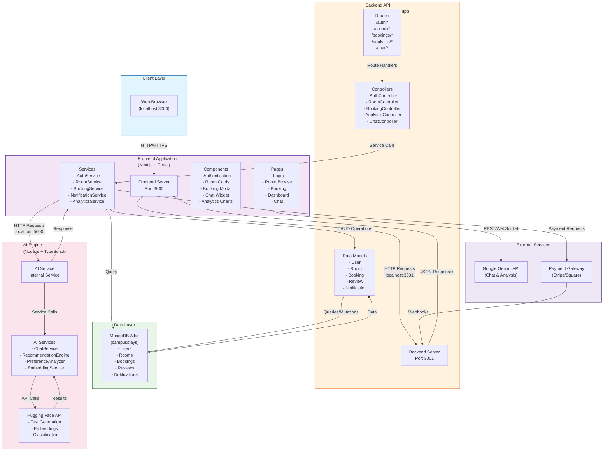
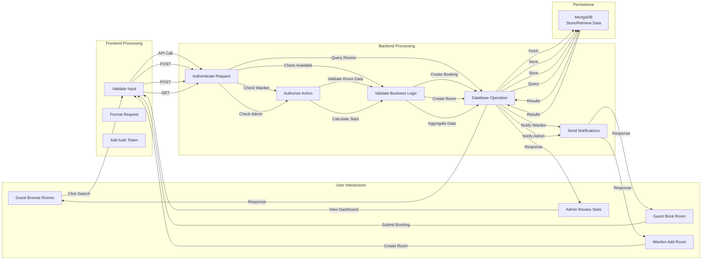
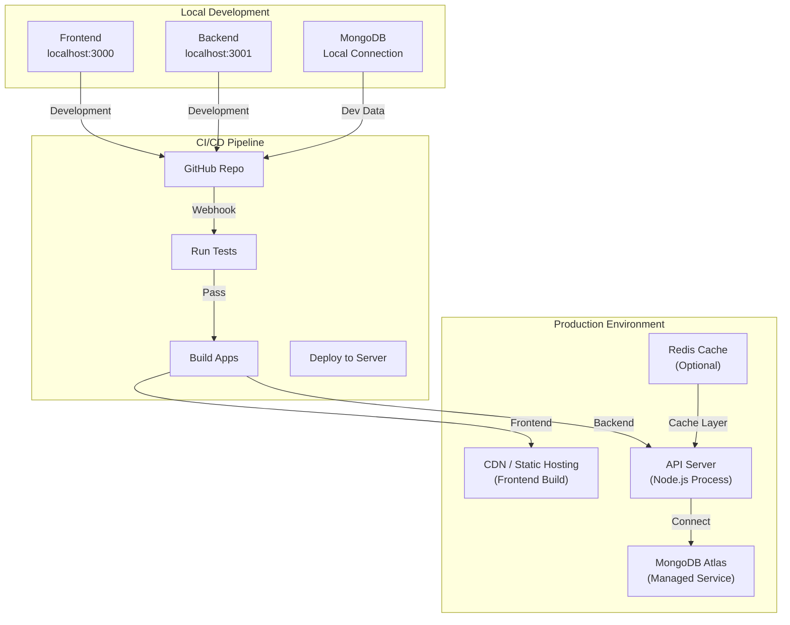
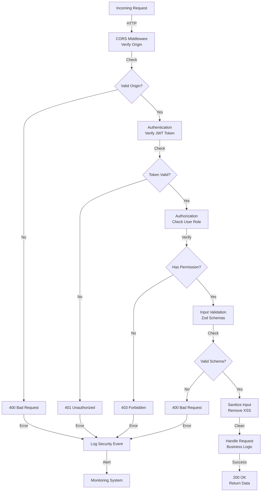
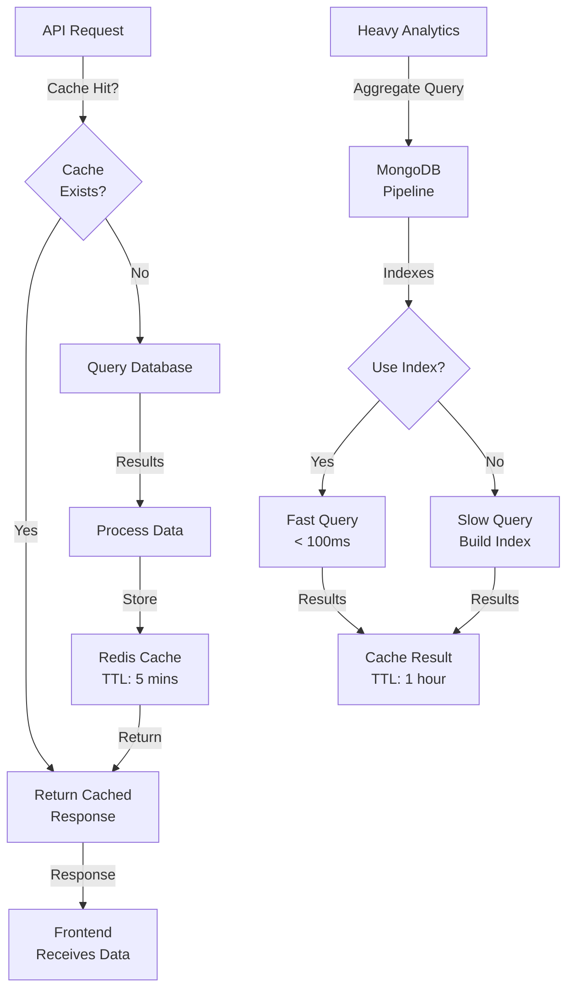

# System Architecture Diagram

## Overall System Interaction

UniLodge is a three-tier monorepo application with separate frontend, backend, and AI engine services communicating through APIs and shared database.



## Data Flow Patterns



## Communication Protocols

### Frontend → Backend (Synchronous - REST API)

```
HTTP Request
├── Method: GET | POST | PUT | DELETE
├── URL: http://localhost:3001/api/{resource}
├── Headers:
│   ├── Authorization: Bearer {JWT_TOKEN}
│   ├── Content-Type: application/json
│   └── X-Request-ID: {UUID}
├── Body: { validated request data }
└── Response: { data | error }

Status Codes:
- 200 OK (success)
- 201 Created (resource created)
- 400 Bad Request (validation error)
- 401 Unauthorized (invalid token)
- 403 Forbidden (insufficient permissions)
- 404 Not Found (resource doesn't exist)
- 500 Internal Server Error (server error)
```

### Backend → Database (MongoDB Queries)

```
Mongoose Operations
├── Create: User.create({ email, password, name })
├── Read: Booking.find({ userId })
├── Update: Room.findByIdAndUpdate(roomId, { isAvailable: false })
├── Delete: Notification.deleteOne({ _id })
├── Aggregate: Booking.aggregate([
│   { $match: { status: 'Confirmed' } },
│   { $group: { _id: '$roomId', count: { $sum: 1 } } }
│ ])
└── Transaction: session.withTransaction(() => {...})
```

### Backend → AI Engine (Internal HTTP)

```
HTTP Request
├── Method: POST
├── URL: http://localhost:5000/api/ai
├── Body: {
│   action: 'chat' | 'recommend',
│   userId: ObjectId,
│   message: string,
│   context: { userData, preferences }
│ }
└── Response: {
    message: string,
    recommendations?: Room[]
  }
```

### Frontend → External Services (Direct)

```
Google Gemini API
├── Method: POST
├── URL: https://generativelanguage.googleapis.com/v1beta/...
├── Headers: { Authorization: Bearer GEMINI_API_KEY }
└── Response: { generatedText, ... }
```

## Deployment Architecture



## Security Layer



## Performance Optimization



## Monitoring & Logging

```
Application Logging
├── Auth Events: login, logout, token refresh failures
├── Database: connection status, slow queries (>1s)
├── Errors: unhandled exceptions, API failures
├── Performance: response times, request count
└── Security: unauthorized access attempts, validation failures

Log Destinations:
├── Console (development)
├── File System (production)
├── Monitoring Service (Sentry, LogRocket, etc.)
└── Analytics (Google Analytics, Mixpanel)

Alerts Triggered:
├── HTTP 500 errors (>5 in 5 mins)
├── Database disconnection
├── Payment processing failures
├── Authentication attack patterns (>10 failed logins)
└── Service latency (>2 seconds)
```
