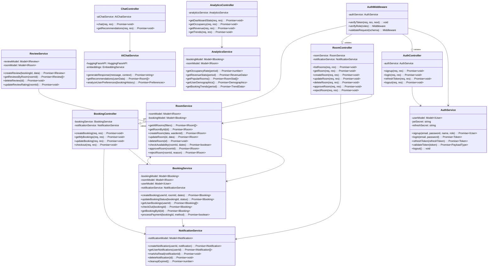
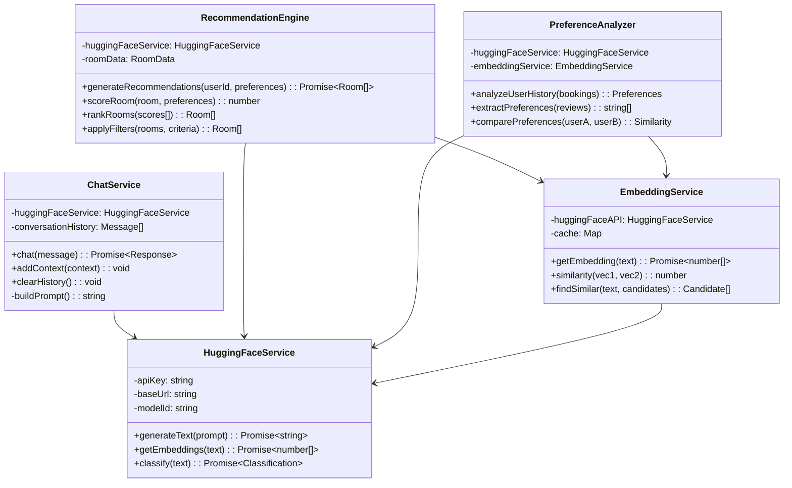
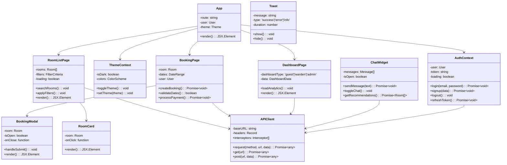
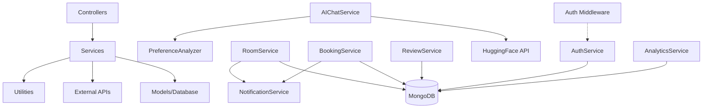

# Class Diagram (UML)

## Backend Architecture - Services and Controllers

```mermaid
classDiagram
    class AuthService {
        -userModel: Model~IUser~
        -jwtSecret: string
        -refreshSecret: string
        +signup(email, password, name, role): Promise~IUser~
        +login(email, password): Promise~Token~
        +refreshToken(refreshToken): Promise~Token~
        +validateToken(token): Promise~PayloadType~
        +logout(): void
    }

    class RoomService {
        -roomModel: Model~IRoom~
        -bookingModel: Model~IBooking~
        +getAllRooms(filters): Promise~IRoom[]~
        +getRoomById(id): Promise~IRoom~
        +createRoom(data, wardenId): Promise~IRoom~
        +updateRoom(id, data): Promise~IRoom~
        +deleteRoom(id): Promise~void~
        +checkAvailability(roomId, dates): Promise~boolean~
        +approveRoom(roomId): Promise~IRoom~
        +rejectRoom(roomId, reason): Promise~IRoom~
    }

    class BookingService {
        -bookingModel: Model~IBooking~
        -roomModel: Model~IRoom~
        -userModel: Model~IUser~
        -notificationService: NotificationService
        +createBooking(userId, roomId, dates): Promise~IBooking~
        +updateBookingStatus(bookingId, status): Promise~IBooking~
        +getUserBookings(userId): Promise~IBooking[]~
        +checkOut(bookingId): Promise~IBooking~
        +getBookingById(id): Promise~IBooking~
        +processPayment(bookingId, method): Promise~boolean~
    }

    class ReviewService {
        -reviewModel: Model~IReview~
        -roomModel: Model~IRoom~
        +createReview(bookingId, data): Promise~IReview~
        +getReviewsByRoom(roomId): Promise~IReview[]~
        +deleteReview(id): Promise~void~
        +updateReviewRating(roomId): Promise~void~
    }

    class NotificationService {
        -notificationModel: Model~INotification~
        +createNotification(userId, notification): Promise~INotification~
        +getUserNotifications(userId): Promise~INotification[]~
        +markAsRead(notificationId): Promise~void~
        +deleteNotification(id): Promise~void~
        +cleanupExpired(): Promise~number~
    }

    class AIChatService {
        -huggingFaceAPI: HuggingFaceAPI
        -embeddings: EmbeddingService
        +generateResponse(message, context): Promise~string~
        +getRecommendations(userData): Promise~Room[]~
        +analyzeUserPreferences(bookingHistory): Promise~Preferences~
    }

    class AnalyticsService {
        -bookingModel: Model~IBooking~
        -roomModel: Model~IRoom~
        +getOccupancyRate(period): Promise~number~
        +getRevenueStats(period): Promise~RevenueData~
        +getPopularRooms(): Promise~RoomStat[]~
        +getUserDemographics(): Promise~Demographics~
        +getBookingTrends(period): Promise~TrendData~
    }

    class AuthController {
        -authService: AuthService
        +signup(req, res): Promise~void~
        +login(req, res): Promise~void~
        +refreshToken(req, res): Promise~void~
        +logout(req, res): Promise~void~
    }

    class RoomController {
        -roomService: RoomService
        -notificationService: NotificationService
        +listRooms(req, res): Promise~void~
        +getRoom(req, res): Promise~void~
        +createRoom(req, res): Promise~void~
        +updateRoom(req, res): Promise~void~
        +deleteRoom(req, res): Promise~void~
        +approveRoom(req, res): Promise~void~
        +rejectRoom(req, res): Promise~void~
    }

    class BookingController {
        -bookingService: BookingService
        -notificationService: NotificationService
        +createBooking(req, res): Promise~void~
        +getMyBookings(req, res): Promise~void~
        +updateBooking(req, res): Promise~void~
        +checkout(req, res): Promise~void~
    }

    class AnalyticsController {
        -analyticsService: AnalyticsService
        +getDashboardStats(req, res): Promise~void~
        +getOccupancy(req, res): Promise~void~
        +getRevenue(req, res): Promise~void~
        +getTrends(req, res): Promise~void~
    }

    class ChatController {
        -aiChatService: AIChatService
        +chat(req, res): Promise~void~
        +getRecommendations(req, res): Promise~void~
    }

    class AuthMiddleware {
        -authService: AuthService
        +verifyToken(req, res, next): void
        +verifyRole(roles): Middleware
        +validateRequest(schema): Middleware
    }

    %% Relationships
    AuthController --> AuthService
    RoomController --> RoomService
    RoomController --> NotificationService
    BookingController --> BookingService
    BookingController --> NotificationService
    AnalyticsController --> AnalyticsService
    ChatController --> AIChatService

    BookingService --> RoomService
    BookingService --> NotificationService
    RoomService --> BookingService
    ReviewService --|> "updates" RoomService

    AuthMiddleware --> AuthService
    AuthMiddleware --|> "validates" AuthController
    AuthMiddleware --|> "validates" RoomController
    AuthMiddleware --|> "validates" BookingController
```

## AI Engine Architecture

```mermaid
classDiagram
    class HuggingFaceService {
        -apiKey: string
        -baseUrl: string
        -modelId: string
        +generateText(prompt): Promise~string~
        +getEmbeddings(text): Promise~number[]~
        +classify(text): Promise~Classification~
    }

    class RecommendationEngine {
        -huggingFaceService: HuggingFaceService
        -roomData: RoomData
        +generateRecommendations(userId, preferences): Promise~Room[]~
        +scoreRoom(room, preferences): number
        +rankRooms(scores[]): Room[]
        +applyFilters(rooms, criteria): Room[]
    }

    class PreferenceAnalyzer {
        -huggingFaceService: HuggingFaceService
        -embeddingService: EmbeddingService
        +analyzeUserHistory(bookings): Preferences
        +extractPreferences(reviews): string[]
        +comparePreferences(userA, userB): Similarity
    }

    class EmbeddingService {
        -huggingFaceAPI: HuggingFaceService
        -cache: Map
        +getEmbedding(text): Promise~number[]~
        +similarity(vec1, vec2): number
        +findSimilar(text, candidates): Candidate[]
    }

    class ChatService {
        -huggingFaceService: HuggingFaceService
        -conversationHistory: Message[]
        +chat(message): Promise~Response~
        +addContext(context): void
        +clearHistory(): void
        -buildPrompt(): string
    }

    ChatService --> HuggingFaceService
    RecommendationEngine --> HuggingFaceService
    RecommendationEngine --> EmbeddingService
    PreferenceAnalyzer --> HuggingFaceService
    PreferenceAnalyzer --> EmbeddingService
    EmbeddingService --> HuggingFaceService
```

## Frontend Architecture (React/Next.js)

```mermaid
classDiagram
    class App {
        -route: string
        -user: User
        -theme: Theme
        +render(): JSX.Element
    }

    class AuthContext {
        -user: User
        -token: string
        -loading: boolean
        +login(email, password): Promise~void~
        +signup(data): Promise~void~
        +logout(): void
        +refreshToken(): Promise~void~
    }

    class ThemeContext {
        -isDark: boolean
        -colors: ColorScheme
        +toggleTheme(): void
        +setTheme(theme): void
    }

    class Toast {
        -message: string
        -type: 'success'|'error'|'info'
        -duration: number
        +show(): void
        +hide(): void
    }

    class APIClient {
        -baseURL: string
        -headers: Record
        +request(method, url, data): Promise~any~
        +get(url): Promise~any~
        +post(url, data): Promise~any~
        +interceptors: Interceptor[]
    }

    class RoomListPage {
        -rooms: Room[]
        -filters: FilterCriteria
        -loading: boolean
        +searchRooms(): void
        +applyFilters(): void
        +render(): JSX.Element
    }

    class BookingPage {
        -room: Room
        -dates: DateRange
        -user: User
        +createBooking(): Promise~void~
        +validateDates(): boolean
        +processPayment(): Promise~void~
    }

    class DashboardPage {
        -dashboardType: 'guest'|'warden'|'admin'
        -data: DashboardData
        +loadAnalytics(): void
        +render(): JSX.Element
    }

    class ChatWidget {
        -messages: Message[]
        -isOpen: boolean
        +sendMessage(text): Promise~void~
        +toggleChat(): void
        +getRecommendations(): Promise~Room[]~
    }

    class RoomCard {
        -room: Room
        -onClick: function
        +render(): JSX.Element
    }

    class BookingModal {
        -room: Room
        -isOpen: boolean
        -onClose: function
        +handleSubmit(): void
        +render(): JSX.Element
    }

    %% Relationships
    App --> AuthContext
    App --> ThemeContext
    App --> RoomListPage
    App --> BookingPage
    App --> DashboardPage

    RoomListPage --> APIClient
    RoomListPage --> RoomCard
    BookingPage --> APIClient
    BookingPage --> BookingModal
    DashboardPage --> APIClient
    ChatWidget --> APIClient

    AuthContext --> APIClient
```

## Service Layer Dependencies

```mermaid
graph TD
    A[Controllers] --> B[Services]
    B --> C[Models/Database]
    B --> D[External APIs]
    B --> E[Utilities]

    Auth[AuthService] --> Models[(MongoDB)]
    Room[RoomService] --> Models
    Booking[BookingService] --> Models
    Review[ReviewService] --> Models

    Booking --> Notification[NotificationService]
    Room --> Notification

    AI[AIChatService] --> HF["HuggingFace API"]
    AI --> Analysis[PreferenceAnalyzer]

    Analytics[AnalyticsService] --> Models

    Middleware["Auth Middleware"] -.-> Auth
```
