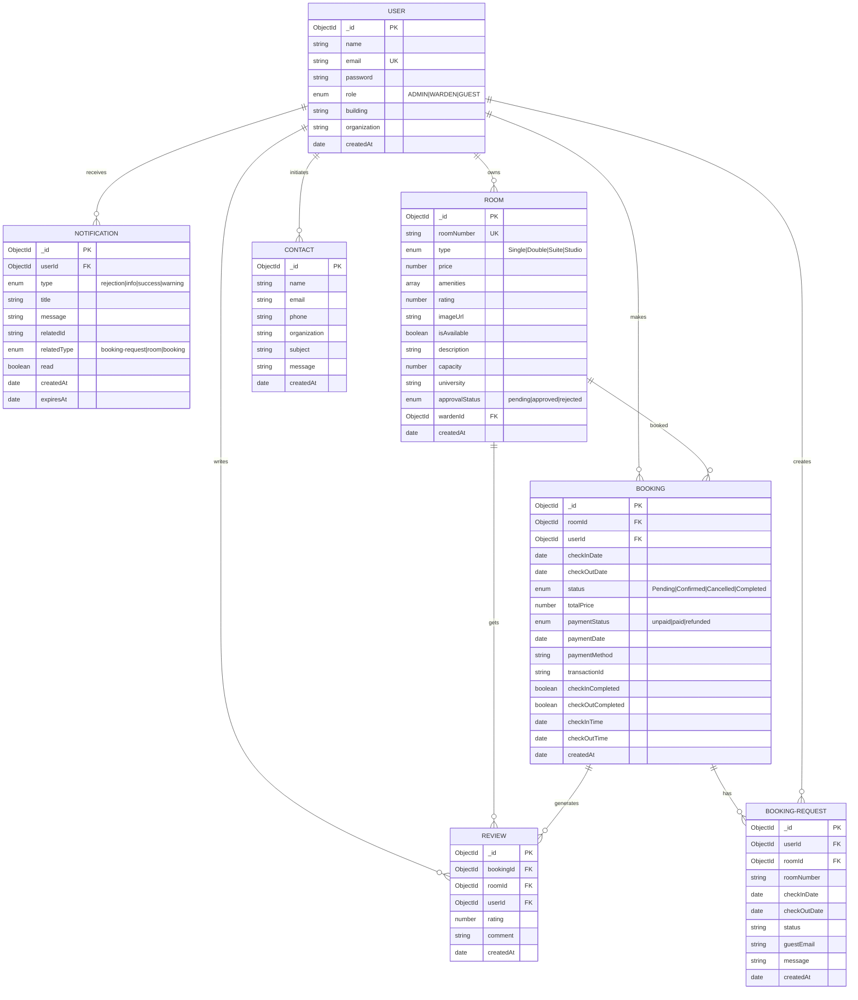

# Entity-Relationship Diagram (ER)

## Database Schema Overview

The UniLodge application uses MongoDB with the following primary entities and their relationships:



## Key Relationships

### User Entity (Central)

- **Cardinality**: One User can have many Bookings, Reviews, Notifications
- **Roles**: ADMIN (manages platform), WARDEN (manages rooms/buildings), GUEST (books rooms)
- **Primary Key**: \_id (MongoDB ObjectId)
- **Unique Constraint**: email

### Room Entity (Resource)

- **Cardinality**: One Room can have many Bookings and Reviews
- **Referenced by**: Room documents reference wardenId (User who owns the room)
- **Status Flow**: pending → approved/rejected
- **Availability**: Tracked through isAvailable flag and booking overlap detection

### Booking Entity (Transaction)

- **Cardinality**: One Booking creates one Review (optional)
- **Foreign Keys**: References both Room and User
- **Payment Flow**: unpaid → paid → refunded (if applicable)
- **Status Flow**: Pending → Confirmed/Cancelled → Completed
- **Indices**: (roomId, checkInDate, checkOutDate) for availability queries; userId for user bookings

### Review Entity (Feedback)

- **Cardinality**: One Review is tied to one Booking
- **References**: Reviews track bookingId, roomId, and userId for traceability
- **Rating**: 1-5 scale; rolled up to Room rating

### Booking Request Entity (Pre-Booking)

- **Cardinality**: One per User per Room inquiry
- **Status**: Tracks request lifecycle before confirmation
- **Auto-generation**: Triggered when guest expresses interest

### Notification Entity (Communication)

- **Cardinality**: One User receives many Notifications
- **Types**: rejection, info, success, warning
- **Related Items**: Can reference bookings, rooms, or booking requests
- **Expiration**: Optional TTL for automatic cleanup

## Data Flow

```
Guest Registration
    ↓
User (GUEST role)
    ↓
Browse Rooms → Room availability check (Booking table)
    ↓
Create Booking Request
    ↓
Warden Review → NOTIFICATION created
    ↓
Booking Confirmation/Rejection
    ↓
If Confirmed: Create Booking + Payment
    ↓
Check In/Out
    ↓
Create Review/Rating
    ↓
Update Room rating aggregate
```

## Indices for Performance

```typescript
// Booking Queries
BookingSchema.index({ roomId: 1, checkInDate: 1, checkOutDate: 1 }); // Availability checks
BookingSchema.index({ userId: 1 }); // User's bookings

// Common Query Patterns
- Find available rooms: Booking.find({ roomId, checkInDate <= date, checkOutDate >= date })
- User's bookings: Booking.find({ userId })
- Room reviews: Review.find({ roomId })
- User notifications: Notification.find({ userId, read: false })
```

## MongoDB Connection

- **URI**: MongoDB Atlas (campusstays database)
- **Collections**: Users, Rooms, Bookings, Reviews, BookingRequests, Notifications, Contacts
- **Version**: Latest Mongoose with TypeScript support
