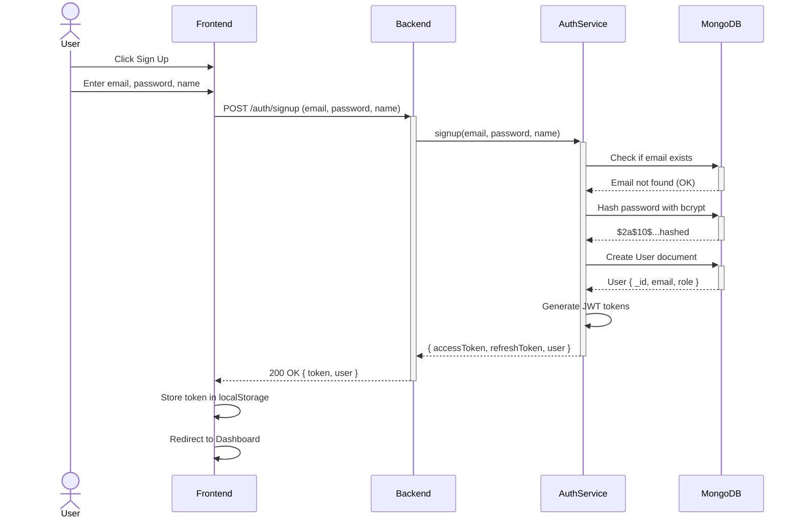
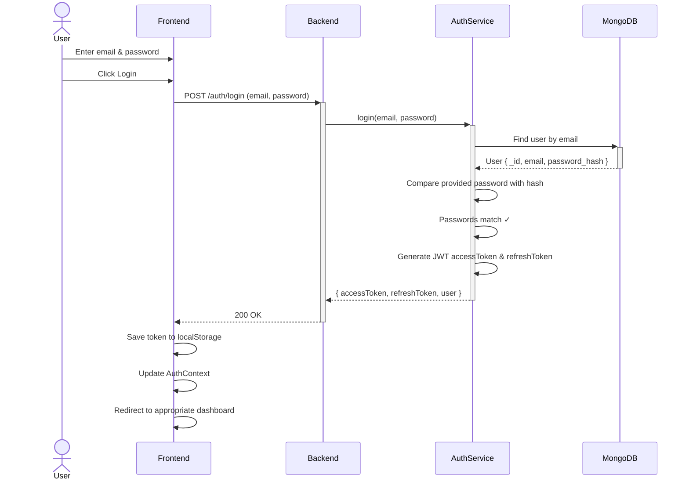
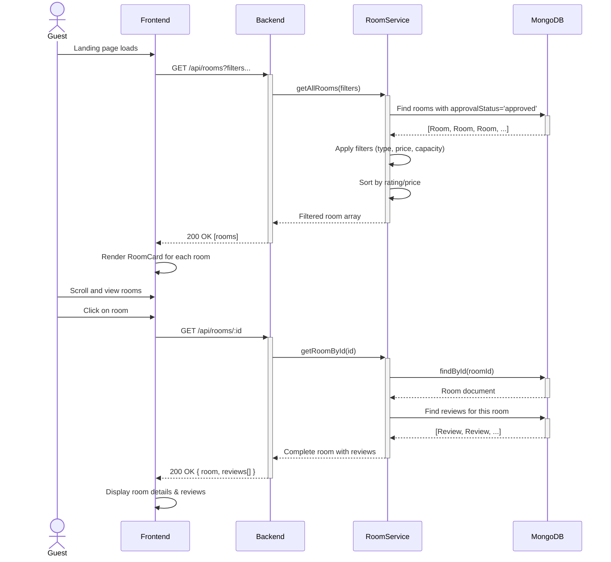
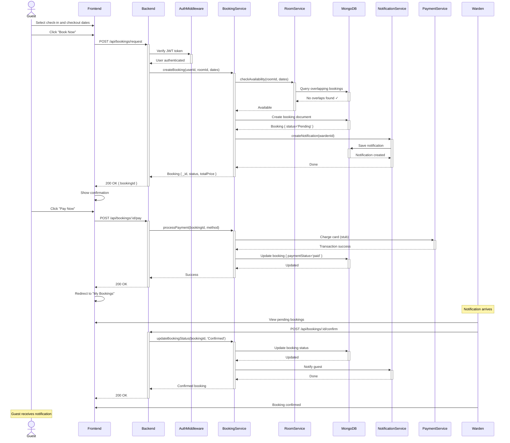
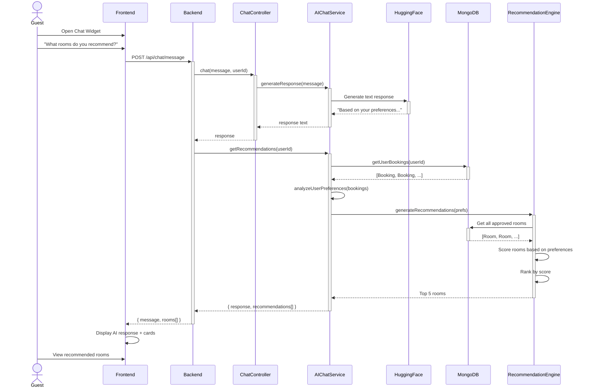
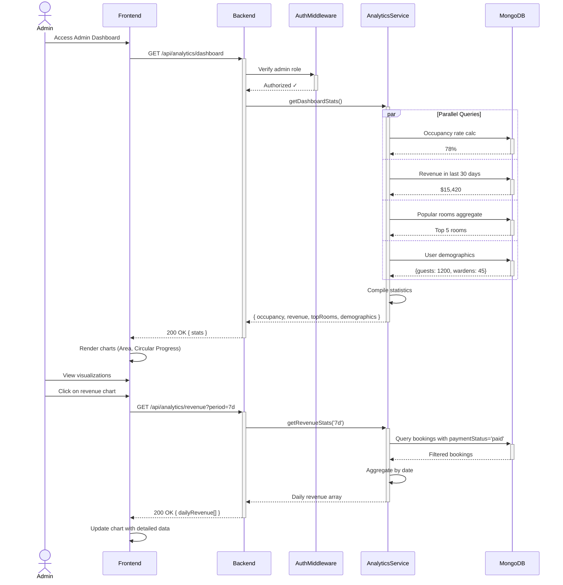
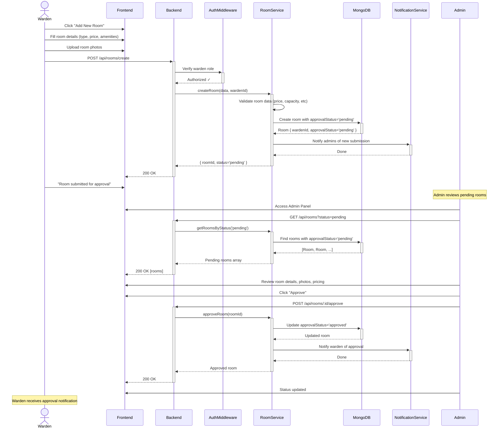
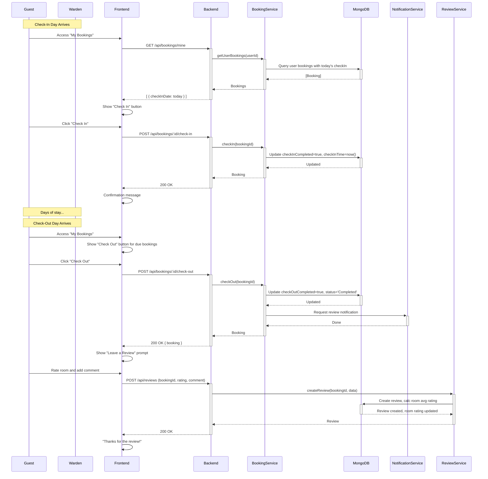
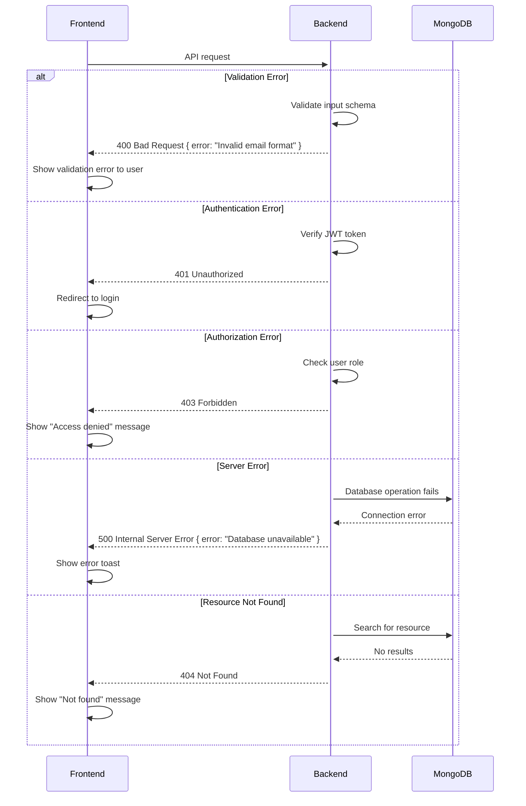

# Sequence Diagrams - Workflow Interactions

## 1. User Authentication Flow (Sign Up & Login)

## 2. Room Listing & Search Flow

## 3. Booking Request & Confirmation Flow

## 4. AI Chat & Recommendations Flow

## 5. Admin Dashboard Analytics Flow

## 6. Room Approval Workflow (Warden → Admin)

## 7. Check-In/Check-Out Process

## Error Handling Flows

